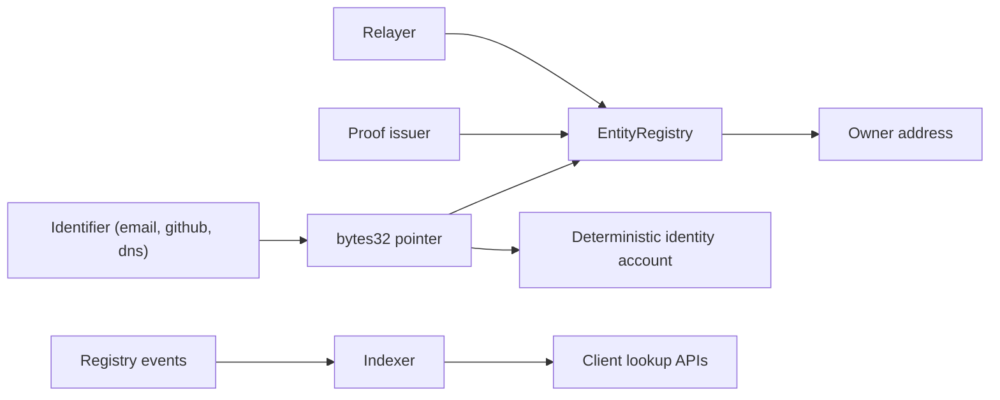
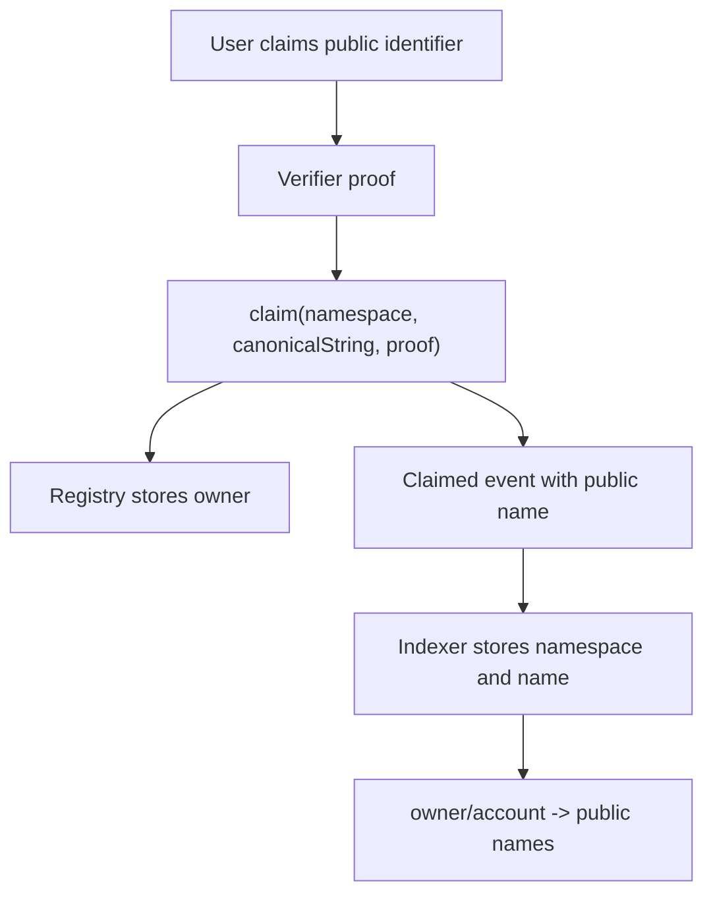
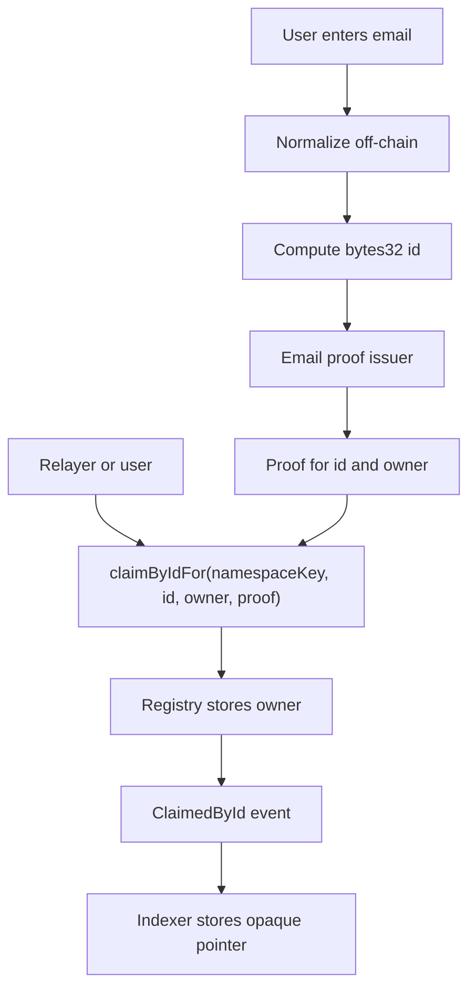

# Open Privy Infrastructure Review

## Executive Summary

Ethereum Entity Registry has the right base primitives for open, Privy-like infrastructure: identifiers become deterministic `bytes32` pointers, verifiers prove control of off-chain identities, identity accounts can be addressed before onboarding, and an indexer can expose product-friendly lookup APIs.

What is missing is the product and protocol layer that turns those primitives into email-first onboarding:

- privacy-preserving claim paths that never put email addresses in calldata or events
- relayer-friendly claims where the proof authorizes the intended owner, not `msg.sender`
- a clear embedded signer or passkey strategy
- one canonical account deployer per network
- indexer-backed reverse lookup for public names
- privacy rules for private identifiers

The goal should not be to clone Privy as a hosted vendor. The goal should be to define open infrastructure that gives applications the same UX properties without coupling users' wallets, identifiers, and account addresses to a proprietary provider.

## Product Target

"Open Privy infrastructure" means:

1. A user can enter an email, social account, domain, repository, or package name and get a deterministic account address.
2. A sender can fund that address before the recipient has onboarded.
3. The recipient can prove control of the identifier and take control without installing a wallet extension.
4. Applications can sponsor onboarding transactions.
5. Public identifiers remain discoverable.
6. Private identifiers, especially email addresses, never appear on-chain unless a user explicitly opts into disclosure.
7. Any frontend, verifier, relayer, or indexer can participate without becoming the canonical custodian of user identity.

This is best understood as three layers:



The registry should stay pointer-first. User-friendly lookup, display names, and privacy policy should live mostly in the indexer and application layer.

## Current State

### What Already Works

- `EntityRegistry` maps `bytes32 id` to an owner and resolves aliases through `ownerOf(id)`.
- `IVerifier` already verifies `(id, claimant, proof)`, which means the verifier interface does not need plaintext identifiers.
- `OracleVerifier` signs EIP-712 proofs over `(id, claimant, expiry)`.
- `IdentityAccount` gates execution through `registry.ownerOf(id)`.
- `EntityRegistry.predictAddress(id)` and `AccountFactory.predictAddress(id)` both provide deterministic account addresses.
- The SDK can compute ids and resolve deposit addresses.
- The indexer stores identifiers, owners, account addresses, and aliases from events.
- The web app already uses an owner-filtered identifier query for a wallet page.

### What Does Not Work Yet

- `claim(namespace, canonicalString, proof)` exposes plaintext identifiers in calldata and events.
- There is no production `claimById`, `claimByIdFor`, or `revokeById`.
- Gasless claims cannot use the current `claim` shape because `msg.sender` becomes the owner.
- Email is not implemented as an end-to-end namespace in contracts, SDK, app, or indexer.
- Passkeys and embedded signers are discussed conceptually, not implemented.
- Reverse lookup exists only as a low-level indexer query shape, not as a clear product API.
- There are two possible account deployers, which creates two deterministic address spaces for the same id.

## Desired Architecture

### Public Identifier Flow

Public identifiers include GitHub repositories, DNS names, npm packages, and other names where discoverability is useful.



For these identifiers, the current plaintext `claim` path is acceptable and useful. Indexers can show `github:org/repo` for an owner address, wallets can display public names, and applications can search by namespace.

### Private Identifier Flow

Private identifiers include email addresses, phone numbers, private handles, or any personal identifier where plaintext disclosure is unacceptable.



The private path should not emit `namespace` or `canonicalString`. The indexer may know that an opaque email claim exists, but it should not expose the email address unless an off-chain directory has explicit authorization to reveal it.

## Privacy Model

The system needs explicit privacy levels.

### Level 0: Public Claims

The current `claim(namespace, canonicalString, proof)` path. The name is visible in calldata, logs, indexers, and analytics.

Use for:

- GitHub repositories
- DNS domains
- public package names
- organization handles intended for public discovery

### Level 1: Opaque Claims

The proposed `claimById` or `claimByIdFor` path. The contract sees only:

- `bytes32 namespaceKey`
- `bytes32 id`
- `address owner`
- `bytes proof`

Use for:

- email addresses
- phone numbers
- private social handles
- any identifier where public discovery is not desired

### Level 2: Authorized Directories

An optional off-chain directory can map private identifiers to pointers, salts, or display names. This directory should be treated as a privacy-sensitive service, not as canonical protocol state.

Use for:

- "send to email" with salted ids
- private contact discovery
- user-authorized profile display
- notification routing

The chain should not become the directory.

## OAuth And OIDC Verification

Decision: email is the identifier. "Send to email" is a core feature, so the addressable pointer must be derived from the normalized email address, not from an OAuth provider subject.

OAuth/OIDC is the simplest practical way to ship email verification first. The existing verifier shape already supports this: an off-chain service verifies control of an identifier, then signs a proof over `(id, owner, expiry)` that the on-chain `OracleVerifier` can check.

For email, prefer OIDC ID tokens over generic OAuth access tokens. The proof service should verify:

- issuer
- audience
- signature
- expiry
- nonce or session binding
- `email`
- `email_verified == true`

Then it computes the private pointer and signs the registry proof:

```text
email -> normalize -> id -> proof issuer signs (id, owner, expiry)
```

### Email As Identifier, OAuth As Proof

The recommended architecture is:

- the addressable identifier is `email:alice@example.com`
- OAuth/OIDC is one way to prove control of that email
- the registry remains verifier-agnostic

This preserves "send to email" because senders can derive the same id from the email address, subject to the chosen salt policy. Provider-specific identifiers can still exist, but they should be linked as secondary identities rather than replacing the email pointer.

### OAuth Subject As Identifier

An alternative is to identify users by provider subject:

```text
oidc:google:<sub>
oidc:apple:<sub>
oidc:microsoft:<sub>
```

This is often more stable than email and avoids some email reassignment issues. But it is worse for "send to email" because a sender usually does not know the recipient's provider subject. It also fragments the same human across providers.

Use provider subjects for provider-native identities. Use email ids for email-addressable accounts. In this architecture, OAuth subjects are evidence or linked aliases, not the primary addressing scheme for email-based accounts.

### Do Not Make The Protocol OAuth-Only

OAuth-only would be simpler operationally, but it weakens the core architecture. The registry should not assume every identifier is proven by OAuth. DNS, GitHub repository ownership, npm package ownership, zkTLS proofs, DNSSEC, enterprise attestations, and future verifier types should all fit behind the same `IVerifier` boundary.

The better framing is:

> ERC-8185/8186 is verifier-agnostic. OAuth/OIDC is the first production-grade verifier family for email and social onboarding.

This gives applications Privy-like UX without making a specific OAuth provider, identity broker, or hosted service fundamental to the protocol.

## Reverse Lookup

The useful reverse lookup requirement is real:

> Given an Ethereum address, clients should be able to find the public names associated with it.

This should be an indexer feature, not an on-chain mapping.

### Recommended Queries

- `id -> owner`: authoritative on-chain via `ownerOf(id)`
- `id -> account`: deterministic via `predictAddress(id)`
- `owner -> public identifiers`: indexer query by `owner`
- `accountAddress -> public identifiers`: indexer query by `accountAddress`
- `owner -> private identifiers`: not exposed by default
- `accountAddress -> private identifiers`: opaque ids only, unless authorized
- `id -> plaintext private name`: impossible without an off-chain mapping

### Why Not On-Chain Reverse Storage

On-chain owner-to-name arrays would:

- make enumeration easier
- duplicate event-derived state
- increase gas costs for claims, revocations, links, and unlinks
- complicate alias semantics
- leak privacy-sensitive graph structure

The contract should answer "who owns this pointer?" The indexer should answer "which public names can I display for this address?"

### Alias-Aware Lookup

The indexer should distinguish:

- directly claimed identifiers owned by an address
- aliases that resolve to a primary owned by an address
- revoked identifiers
- private opaque identifiers

`ownerOf(aliasId)` resolves aliases on-chain. An indexer API called "names for address" should mirror that behavior instead of only returning rows where `identifier.owner == address`.

## Contract Recommendations

### Add Opaque Claim Functions

Add privacy-preserving claim paths alongside the existing plaintext claim path:

```solidity
function claimById(
    bytes32 namespaceKey,
    bytes32 id,
    bytes calldata proof
) external;

function claimByIdFor(
    bytes32 namespaceKey,
    bytes32 id,
    address owner,
    bytes calldata proof
) external;

function revokeById(bytes32 id) external;
```

`claimById` is the direct self-claim path. `claimByIdFor` is the gasless path. The verifier should check the proof against `owner`, not `msg.sender`.

### Add Opaque Events

```solidity
event ClaimedById(
    bytes32 indexed namespaceKey,
    bytes32 indexed id,
    address indexed owner,
    address verifier
);

event RevokedById(
    bytes32 indexed id,
    address indexed previousOwner
);
```

These events are enough for indexers to track ownership without exposing private names.

### Keep Plaintext Claim

Do not remove `claim(namespace, canonicalString, proof)`. It is useful for public identifiers and indexers. Instead, treat the two paths as separate privacy modes.

### Align Event Metadata

The ERC-8185 asset emits `verifier` in `Claimed`, while the package `EntityRegistry` does not. Include verifier metadata in new events and consider aligning the package event shape before the interface hardens.

### Choose One Canonical Deployer

The registry and standalone account factory can both predict addresses, but they do not predict the same address for the same id. A deployment profile must choose one canonical deployer per network.

Recommended rule:

- Use `EntityRegistry.predictAddress(id)` as the canonical account address for the shared public registry.
- Use standalone `AccountFactory` only for clearly named platform-specific deployments where different addresses are expected.

This needs to be documented prominently because sending funds to the wrong deterministic address is an easy integration failure.

### Consider Reentrancy Protection

`IdentityAccount.execute` performs an arbitrary external call. ERC-8186 recommends reentrancy protection. If the implementation remains general-purpose, add `nonReentrant` or document why it is intentionally omitted.

## Indexer Recommendations

### Add First-Class Reverse Lookup APIs

Expose explicit SDK/indexer methods:

```ts
indexer.identifiers.byOwner(address, options)
indexer.identifiers.byAccountAddress(address, options)
indexer.identifiers.primaryNameForOwner(address, options)
indexer.identifiers.publicNamesForOwner(address, options)
```

Options should include:

- `chainId`
- `includeAliases`
- `includeRevoked`
- `includePrivate`
- `namespace`

Default behavior should be conservative: same chain, public identifiers only, active claims only.

### Add Chain Scope To SDK Types

The indexer schema has `chainId`, but the SDK `Identifier` type and GraphQL selection currently omit it. Add `chainId` to:

- GraphQL selections
- `Identifier`
- `IdentifierFilter`
- owner/account reverse lookup helper options

Without this, address lookup can mix identities across chains.

### Fix Deploy-Before-Claim Rows

`AccountDeployed` can create an identifier row with empty `namespace` and `canonicalString`. A later `Claimed` upsert should update:

- `namespace`
- `canonicalString`
- `owner`
- `claimedAt`
- `revokedAt`

Otherwise a predeployed account can leave the indexer with a blank display name after claim.

### Index All Canonical Account Deployers

If `AccountFactory` remains part of production flows, the indexer must subscribe to its `AccountDeployed` events too. If not, remove or clearly de-emphasize factory-driven account deployment from the canonical flow.

### Store Private Claims Separately

Do not overload public `identifier.namespace` and `identifier.canonicalString` rows with fake values for private identifiers. Prefer explicit fields or a separate privacy-aware model:

- `namespaceKey`
- `id`
- `owner`
- `accountAddress`
- `visibility`
- `claimedAt`
- `revokedAt`

For private claims, `canonicalString` should be absent, not an empty string pretending to be a name.

## SDK Recommendations

### Pointer Resolution

Add clear helpers for the pointer-first model:

```ts
registry.resolvePointer(id)
```

Returning:

```ts
{
  id,
  owner,
  accountAddress,
  isClaimed,
  isDeployed
}
```

This avoids implying that hashes can be reversed.

### Email Helpers

Add email-specific helpers only after deciding the salt policy:

```ts
email.normalize(email)
email.toId(email)
email.toSaltedId(email, salt)
email.predictAddress(emailOrId)
```

If salted ids are used, the SDK must make it obvious when a sender needs an oracle or directory lookup before predicting the address.

### Reverse Lookup Helpers

Expose indexer-backed lookup as product APIs, not raw GraphQL filters:

```ts
sdk.indexer.identifiers.byOwner(owner)
sdk.indexer.identifiers.byAccountAddress(account)
```

These should return display-safe records with a visibility flag.

### Optional Indexer

The SDK currently constructs the indexer eagerly. For open infrastructure, indexer availability should be optional: RPC-only pointer resolution should work even if no indexer URL exists.

## Relayer And Sponsorship

Gasless onboarding requires more than an API endpoint. The contract must let a third party submit a claim for an intended owner.

The minimum viable path:

1. User verifies email or social account off-chain.
2. App creates or selects an owner address.
3. Proof issuer signs `(id, owner, expiry)`.
4. Relayer calls `claimByIdFor(namespaceKey, id, owner, proof)`.
5. Relayer deploys the identity account if needed.
6. User controls the account through the owner key.

This avoids making the relayer the owner.

Longer term, this can become:

- ERC-4337 account abstraction
- paymaster-sponsored claims
- passkey validation modules
- session keys for app-scoped permissions

The protocol should not require any single relayer. Relayers are replaceable operators.

## Embedded Signers And Passkeys

The registry only needs an Ethereum address as owner. The product layer must decide how users get that address.

Options:

- embedded EOA generated in the browser
- passkey-backed smart account
- third-party signer service used only for key management
- user wallet extension
- multisig or organization wallet

Recommended direction:

- Treat the owner as abstract in the registry.
- Build email/passkey onboarding as one supported ownership profile, not as a special registry rule.
- Avoid making the proof issuer, relayer, and key custodian the same required operator.

For an open Privy alternative, the most important separation is:

- proof issuer verifies identity
- owner key controls assets
- relayer pays gas
- indexer exposes lookup
- registry enforces pointer ownership

One service may operate multiple roles, but the protocol should not require that.

## Implementation Roadmap

### Phase 1: Make Current Infrastructure Safer

- Fix indexer deploy-before-claim upserts.
- Add chainId to SDK indexer types and filters.
- Add explicit owner/account reverse lookup helpers.
- Document canonical account deployer per network.
- Document that reverse lookup is indexer-backed and public-identifier-only by default.

### Phase 2: Add Opaque Identifier Claims

- Add `claimById`, `claimByIdFor`, and `revokeById`.
- Add `ClaimedById` and `RevokedById`.
- Index opaque claim events.
- Add SDK pointer-resolution helpers.
- Keep plaintext claims unchanged for public identifiers.

### Phase 3: Email Onboarding

- Define email normalization.
- Choose unsalted or salted ids.
- Implement email proof endpoint with OAuth/OIDC first; OTP or magic link can be added later as another proof method.
- Verify OIDC ID tokens server-side and require `email_verified == true`.
- Register email verifier under `keccak256("email")` or a privacy-preserving verifier route.
- Add relayer endpoint for gasless claim and account deployment.
- Add frontend "send to email" and "claim email account" flows.

### Phase 4: Open Privy Profile

- Add passkey or embedded signer integration.
- Support sponsored transactions.
- Add recovery model.
- Add authorized private directory if salted email discovery is required.
- Publish operator docs for proof issuers, relayers, and indexers.

## Open Questions

### Salt Policy

Unsalted email ids allow sender-side address prediction without a server call, but they are vulnerable to targeted guessing. Salted ids improve privacy, but require a salt coordination mechanism.

Product decision: email remains the primary identifier because send-to-email requires the pointer to be derived from the email address.

Recommended default for production privacy: salted or directory-mediated email ids if the product can tolerate a directory lookup.

Recommended default for a prototype: unsalted email ids, with clear warnings about targeted guessing.

### Namespace Privacy

`namespaceKey = keccak256("email")` reveals that a claim is email-based. If that is too much leakage, private namespaces can route through a universal private verifier, but this weakens public analytics and verifier attribution.

### Reverse Lookup Visibility

Should a private claim appear at all in `owner -> identifiers` results?

Recommended default: no, unless the caller requests opaque private records or is authorized by a private directory.

### Account Address Canonicality

Should the registry itself be the only canonical account deployer, or should a separate `AccountFactory` be the standard ERC-8186 deployer?

Recommended default: registry-owned deployer for the shared public registry; named factories for platform-specific address spaces.

### Recovery

Email onboarding without wallet extensions raises recovery expectations. Recovery should be implemented at the owner/account layer, not by giving the registry arbitrary transfer power.

## Concrete Change List

Contracts:

- Add `claimById`.
- Add `claimByIdFor`.
- Add `revokeById`.
- Add opaque events with verifier metadata.
- Consider event parity with ERC-8185 `Claimed`.
- Decide canonical deployer and document it.
- Consider reentrancy protection on `IdentityAccount.execute`.

Indexer:

- Fix `Claimed` upsert to update namespace and canonical string.
- Add chain-scoped reverse lookup APIs.
- Add alias-aware owner lookup.
- Add `accountAddress -> identifier` helper.
- Add opaque claim indexing.
- Avoid exposing private canonical strings by default.

SDK:

- Add `resolvePointer(id)`.
- Add `byOwner` and `byAccountAddress` helpers.
- Add `chainId` to indexer types and filters.
- Make indexer construction optional or gracefully nullable.
- Add email helper functions after salt policy is chosen.

Docs:

- Link this review from `README.md`.
- Link this review from `privacy-preserving-email-identity.md`.
- Add a deployment profile describing proof issuer, relayer, signer, registry, account, and indexer roles.
- Document OAuth/OIDC as the recommended first email proof method, while keeping the protocol verifier-agnostic.
- Add an ERC-8185/8186 conformance matrix once the contract surface is updated.

## Bottom Line

Ethereum Entity Registry can become open Privy infrastructure if it stays disciplined about boundaries:

- the registry owns pointer-to-owner truth
- deterministic accounts own the funding and execution UX
- verifiers prove off-chain identity
- relayers sponsor onboarding without becoming owners
- indexers provide public reverse lookup
- private directories handle private-name disclosure

The most important next step is to add the opaque claim path and formalize indexer-backed reverse lookup. Those two changes preserve the current public-identifier model while opening the path to email-first onboarding without storing email addresses on-chain.
